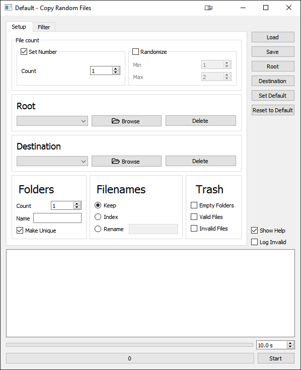
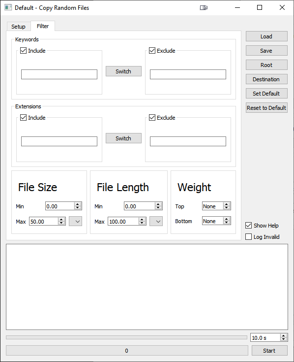

# Copy Random Files

### Copies random files from point A to point B. Customize what and how to copy with various filters.

##### *Setup*

##### *Filters*

## THIS IS A WORK IN PROGRESS

*As of 8/28/2021, Copy Random Files is fully functional, but the UI is not yet fully realized.*

*A Lite version of the program is being actively worked on to set an aesthetic direction for this main version.*

*Progress on the Lite version can be seen [here](https://github.com/jang-w/Copy-Random-Files-Lite)*.
